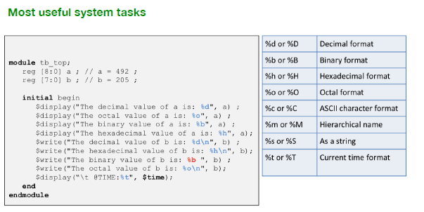

# Python review

## Python in 4 sentences 

1. **NAMES:** Names \(in namespaces\) are _**bound**_ to objects.
2. **REFERENCE:** Every object has its own **namespace**.
3. **OBJECTS:** Objects are the fundamental unit with which Python computes.
   1. We can compute with int objects in mathematical operations 
   2. We can compute with **functions** by calling on them 
   3. We can compute with a module object by **importing** them 
   4. We can compute with class objects by constructing **instances** of the class
4. Python has rules about how names are bound and how things work.

### Binding

**Binding:** making a name refer to a value   
- Using the = symbol  
- Using imports, function definitions and class definitions



### 

#### Using \_ as a variable name

By using \_ your variable is basically 'unnamed' and the interpreter does not expect you to use it.

<table>
  <thead>
    <tr>
      <th style="text-align:left">not using _</th>
      <th style="text-align:left">using _</th>
    </tr>
  </thead>
  <tbody>
    <tr>
      <td style="text-align:left"><code>kv = [k,v for k, v in [list of 2-tuple]]</code>
      </td>
      <td style="text-align:left"><code>only_k = [k for k, _ in [list of 2-tuple]]</code>
      </td>
    </tr>
    <tr>
      <td style="text-align:left"></td>
      <td style="text-align:left">
        <p><code>for _ in [1,2,3]:</code>
        </p>
        <p><code>    print(_) </code>
        </p>
      </td>
    </tr>
  </tbody>
</table>

### Namespaces \(for objects\): \_\_dict\_\_

Every object has a special variable named `__dict__` that stores bindings in a dictionary in which keys are objects' names and values are the objects themselves.

`x.a = 1` is equivalent to `x.__dict__['a'] = 1`

### Importing

\#1 Import module-name form  
- when writing code you use module-name.function

```python
import 'module-name' (, 'more-modules')
import 'module-name' as 'alt-name'
```

\#2 from module-name import  
- directly use the function name in the code

```python
from module-name import attr-name
from module-name import attr-name as alt-name
from module-name import *
```

### Scope

Visibility of a variable. Can be **local** or **global.** We normally want to avoid using global variables, but if a global variable needs to be rebound, then use the keyword `global` to declare that it is global.

<table>
  <thead>
    <tr>
      <th style="text-align:left">This is better</th>
      <th style="text-align:left"><b>DON&apos;T</b>
      </th>
    </tr>
  </thead>
  <tbody>
    <tr>
      <td style="text-align:left">
        <p><code>x = 1</code>
        </p>
        <p><code>def f():<br />   global x<br />   y = 2</code>
        </p>
        <p><code>   print(x,y)</code>
        </p>
        <p><code>   x = 2</code>
        </p>
        <p><code>f()</code>
        </p>
        <p><code>print(x)</code>
        </p>
      </td>
      <td style="text-align:left">
        <p><code>x = 1</code>
        </p>
        <p><code>def f():</code>
        </p>
        <p><code>   y = 2</code>
        </p>
        <p><code>   print(x,y)</code>
        </p>
        <p><code>   x = 2</code>
        </p>
        <p><code>f()</code>
        </p>
        <p><code>print(x)</code>
        </p>
      </td>
    </tr>
    <tr>
      <td style="text-align:left">
        <p>&gt;&gt;&gt; 1 2</p>
        <p>&gt;&gt;&gt; 2</p>
      </td>
      <td style="text-align:left">
        <p>UnboundLocalError exception:</p>
        <p>local variable &apos;x&apos; referenced before assignment</p>
      </td>
    </tr>
  </tbody>
</table>

#### Python looks up / binds names in the following order

1. in the **local** **scope** of the function
2. in any of the **enclosing scopes** 
3. in the **global scope**
4. in the **builtins scope**
5. raise NameError

### Functions

#### Functions vs Methods

* **Functions:** called by function\(args\)
* **Methods:** object.method\(\) 

#### Function Calls

Defining a function is binding a name to it; therefore, you can store a function name \(without the '\(\)'\) into a variable name

```python
def function(x):
    print(1)

one = function #dont include the ()

one('yes')
>>> 1

function('also yes')
>>>1
```

#### Functions can return other functions!

```python
def bigger_than(v) :
    def test(x) :
        return x > v
    return test

old = bigger_than(60)
old(70)
>>> True

bigger_than(60)(70)
>>> True
```

### Lamda

* **lambda:** unnamed function object that represents a very simple function
* **predicate:** a function that returns a boolean

<table>
  <thead>
    <tr>
      <th style="text-align:left">This</th>
      <th style="text-align:left">Same as</th>
    </tr>
  </thead>
  <tbody>
    <tr>
      <td style="text-align:left"><code>...(lambda x,y: x+y)...</code>
      </td>
      <td style="text-align:left">
        <p><code>def f(x,y):</code>
        </p>
        <p><code>    return x + y</code>
        </p>
      </td>
    </tr>
  </tbody>
</table>

examples: 

```python
print((lambda x : x)('Hello World'))
>>> Hello World

x = prompt.for_int('Enter a value in [0,5]', is_legal = (lambda x : 0<=x<=5))
print(x)
>>> only ints between 0 and 5

def bigger_than(v) :
    return (lambda x : x > v)
```

### Parallel Assignment \(aka Sequence unpacking\)

```python
l,m,n = (1,2,[3,4])
print(l,m,n)
>>> 1 2 [3, 4]

l,m,(n,o) = (1, 2, [3,4])
print(l,m,n,o)
>>> 1 2 3 4
```

## Must-know functions

### str.split\( \) and str.join\(\)

```python
'ab;c;ef;;jk'.split(';')
# returns ['ab', 'c', 'ef', '', 'jk']

[s for s in 'ab;c;ef;;jk'.split(';') if s != '']
#returns ['ab', 'c', 'ef', 'jk']

';'.join(['ab', 'c', 'ef', '', 'jk']) == 'ab;c;ef;;jk'
```

### all\(iterable\) and any\(iterable\)

* `all()` returns True if all values in iterable produce True.
* `any()` returns True if at least one value in iterable produce True

```python
x = all( predicate.is_prime(x) for x in l )
```

### max\(\) and min\(\)

```python
max('abcd','xyz') == 'xyz'
min('abcd','xyz') == 'abcd'
min('abcd','xyz', key= lambda x: len(x)) == 'xyz'
```

### zip\(iterables\)

Takes iterable objects \(can be different lengths\) and glues respective elements into a tuple and returns a generator as a result.

```python
z = list(zip( 'abcde', (1, 2, 3) )) == [('a', 1), ('b', 2), ('c', 3)]

for v1,v2 in zip ( ('a','b','c','d','e'), (1,2,3) ):
print(v1,v2)
>>> a 1
>>> b 2
>>> c 3
```

### enumerate\(iterable\)

Takes one iterable \(and an optional starting number\) and produces a generator.

```python
e = enumerate(['a','b','c','d'], 5)
print(list(e))
>>> [(5, 'a'), (6, 'b'), (7, 'c'), (8, 'd')]
```

## 

